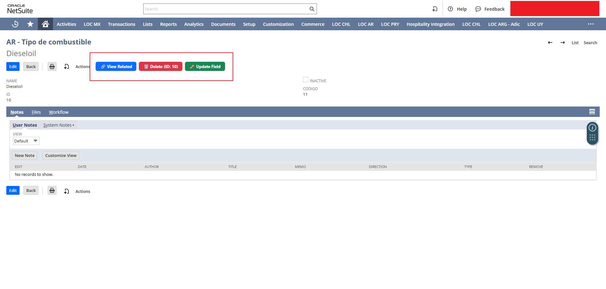
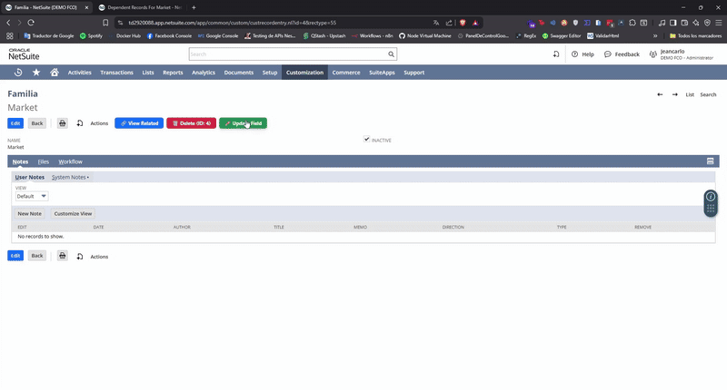

# NetSuite Quick Actions for Developers

**Quick access to essential developer actions on NetSuite records**: delete records, view related records, and update fields with ease.

## 🚀 Features

- 🗑️ **Delete** the current NetSuite record in one click
- 🔗 **View related records** quickly (linked transactions or entities)
- ✏️ **Update record fields** manually or via predefined logic
- ⚙️ Designed specifically for SuiteScript developers and technical admins

## 📦 Installation

1. Clone or download this repository.
2. Go to `chrome://extensions` in your browser.
3. Enable **Developer mode**.
4. Click on **"Load unpacked"** and select the `dist/` folder (after building).
5. You're good to go!

> Make sure you run `npm install && npm run build` if you're using Vite or bundling tools.

## 🧠 Why this extension?

NetSuite can be slow and repetitive during development and testing.  
This extension was created to simplify the life of developers by adding buttons and shortcuts directly on record pages.

## 🛠️ Tech Stack

- Chrome Extension (Manifest v3)
- JavaScript / Vite / HTML
- Injected UI using DOM manipulation

## 📸 Demo

## 🧑‍💻 Author

Developed by [@akanzadev](https://github.com/akanzadev) — feel free to contribute, fork, or suggest ideas.

## 📄 License

[MIT License](LICENSE)
